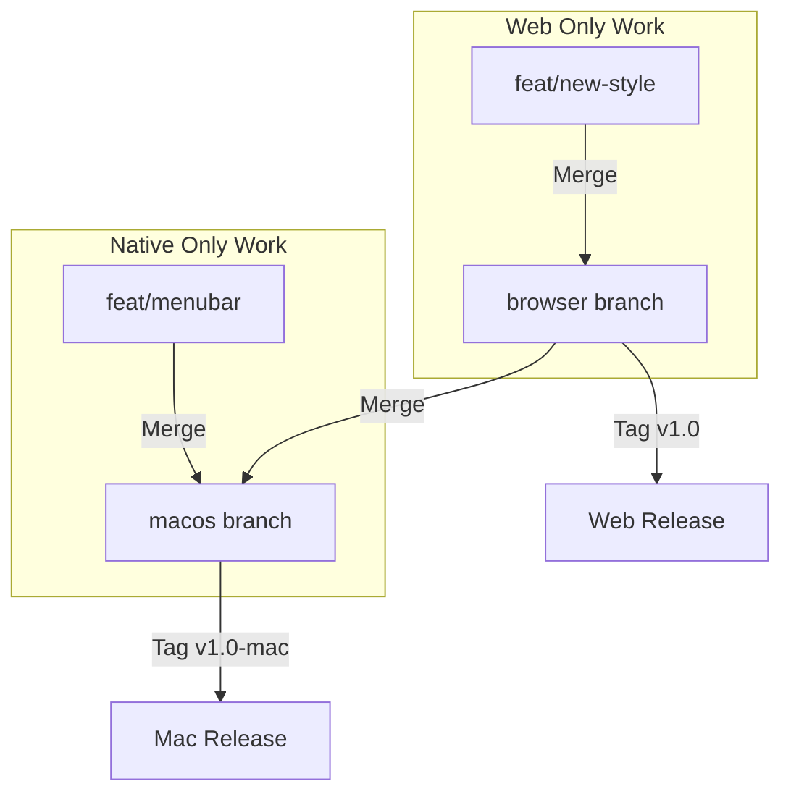

# Release Management Strategy: Browser & macOS

## Current State Analysis
- **`browser`**: Created from commit `4273b87b`. This represents the "Pure Web" baseline.
- **`macos`**: Renamed from `feature/macos-menubar-app`. Contains all `browser` code + Electron wrappers.

## Proposed Branch Structure

To streamline development, we will standardize on two permanent branches:

| Branch Name | Role | Source / Origin |
| :--- | :--- | :--- |
| **`browser`** | **Upstream (Web Core)** | Pure web application. No Electron dependencies. |
| **`macos`** | **Downstream (Desktop)** | Renamed from `feature/macos-menubar-app`. Contains all `browser` code + Electron wrappers. |

## Migration Steps (One-Time Setup)

1.  **Establish `macos` Branch**:
    -   Rename `feature/macos-menubar-app` to `macos` to signify it as the long-term release branch for desktop.
    -   Command: `git branch -m feature/macos-menubar-app macos`

2.  **Sync Check**:
    -   Ensure `browser` has all *generic* web features you want. If `macos` has recent web-only fixes (CSS/JS updates unrelated to Electron) that aren't in `browser`, cherry-pick them into `browser`.
    -   *Goal*: `browser` should be the "cleanest" version of the app logic.

## Ongoing Workflow

### 1. Developing Web Features (Core)
*Examples: Changing timers, Updating CSS, modifying `script.js` logic.*

1.  Checkout `browser`.
2.  Create feature branch: `git checkout -b feat/new-timer`.
3.  Commit and merge to `browser`.
4.  **Propagate to macOS**:
    ```bash
    git checkout macos
    git merge browser
    # Verify Electron integration is still working
    git push origin macos
    ```

### 2. Developing macOS Features
*Examples: Menubar icons, TouchBar, System Preferences.*

1.  Checkout `macos`.
2.  Create feature branch: `git checkout -b feat/native-menu`.
3.  Commit and merge to `macos`.
4.  **DO NOT** merge to `browser` (keeps browser branch lightweight).

## Deployment & Release

### Tagging Convention
- Web: `v{Version}` (e.g. `v1.1.0`)
- Mac: `v{Version}-mac` (e.g. `v1.1.0-mac`)

### Release Checklist
1.  **Update Web**:
    -   On `browser`, bump version to `1.1.0`.
    -   Commit & Tag `v1.1.0`.
2.  **Update Mac**:
    -   On `macos`, merge `browser` (getting the 1.1.0 bump).
    -   Tag `v1.1.0-mac`.
    -   Build & Distribute.

## Summary Diagram

